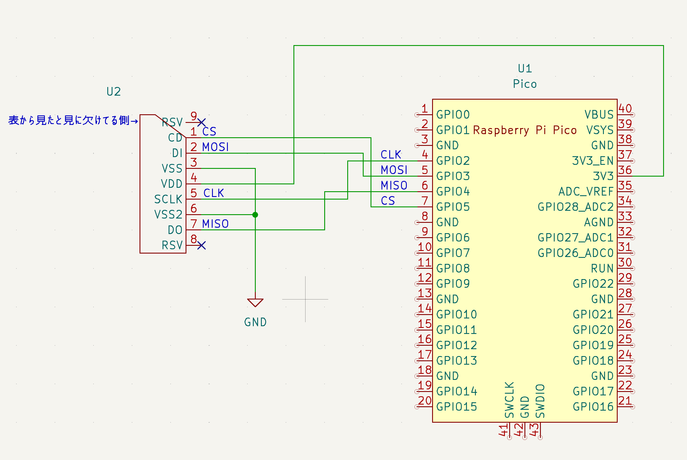
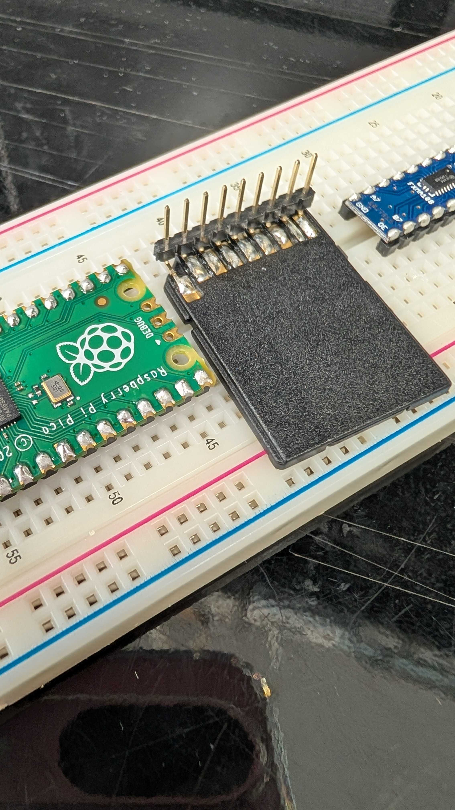
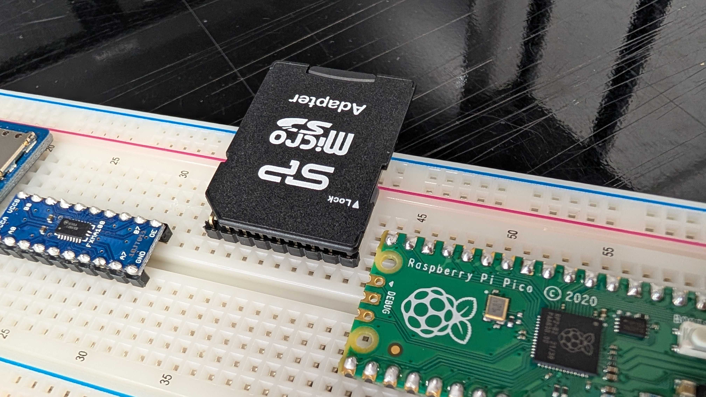

# microSD Converter for Raspberry Pi Pico
SDカードアダプタにピンヘッダを取り付けて作るマイコン用の簡易的なMicroSDアダプタモジュールの説明をします。
Raspberry Pi PicoとmicroSDカードを接続してSDカードを読み取るための簡易的な回路例を紹介しています。  

## 配線例

- microSDコネクタ `CS` ピン → Pico `GPIO7`
- microSDコネクタ `MOSI` ピン → Pico `GPIO5`
- microSDコネクタ `MISO` ピン → Pico `GPIO6`
- microSDコネクタ `CLK` ピン → Pico `GPIO4`
- その他、3.3V電源とGNDを正しく配線してください

## 回路図

下図のように配線してください。

詳細なピンアサインやサンプルコードの使用方法などは、ソースコードや各種ドキュメントを参照してください。

## 参考写真

